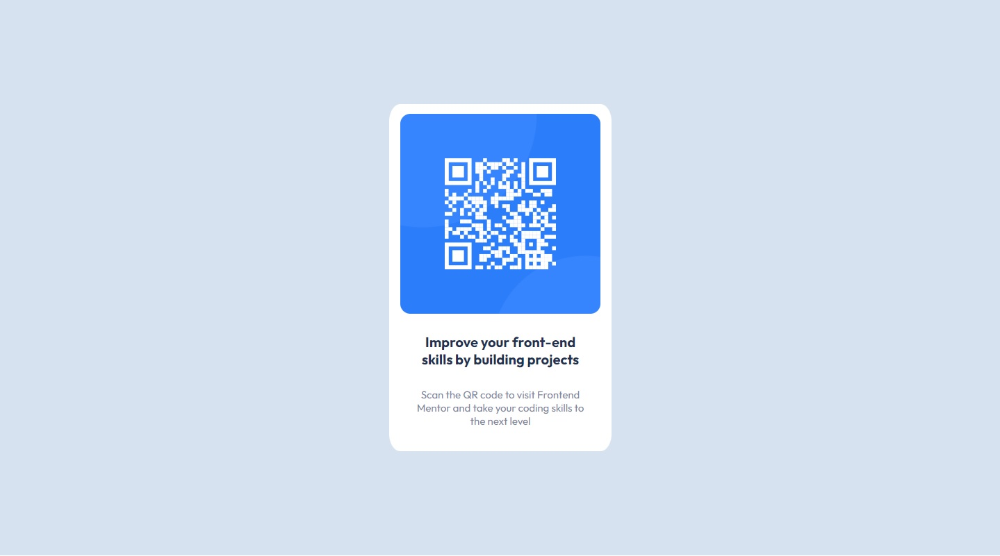

# Frontend Mentor - QR code component solution

This is a solution to the [QR code component challenge on Frontend Mentor](https://www.frontendmentor.io/challenges/qr-code-component-iux_sIO_H).

## Overview

 

This was the first challenge of the frontendmentor site that I do, I hope that I will do many others.

### Screenshot

### Links

- [Solution in Front End Mentor Site:](https://www.frontendmentor.io/solutions/qr-code-component-5neH5vp_Ms)
- [Live Site](https://vitormagnago.github.io/qr-code-component-main/)

## My process

Like all pages I start from scratch, I have difficulties getting started, but I'm starting to find a flow to start my work.

I didn't have the Figma file with the design to follow, I only had the images and as I still have a little difficulty defining the scales, font sizes, margins and padding. I used Photoshop to count the pixels of some parts of the design.

### What I learned

It was the first time following a design. Even though they were just images, I had to consult them a few times.

I also used media queries to create some responsiveness. It didn't do much, it just changed the size of the container where the card is placed, but it was worth the effort. I still need to learn about responsive design.

## Author

- Frontend Mentor - [@VitorMagnago](https://www.frontendmentor.io/profile/VitorMagnago)
